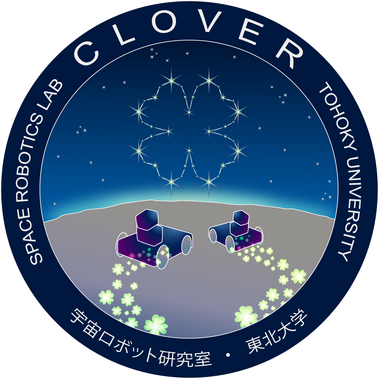
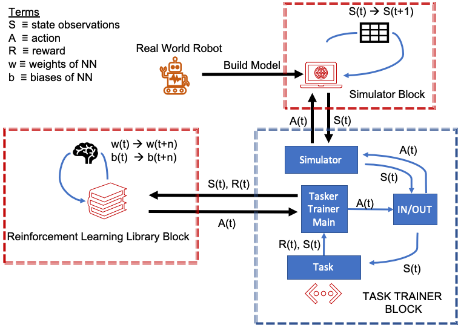
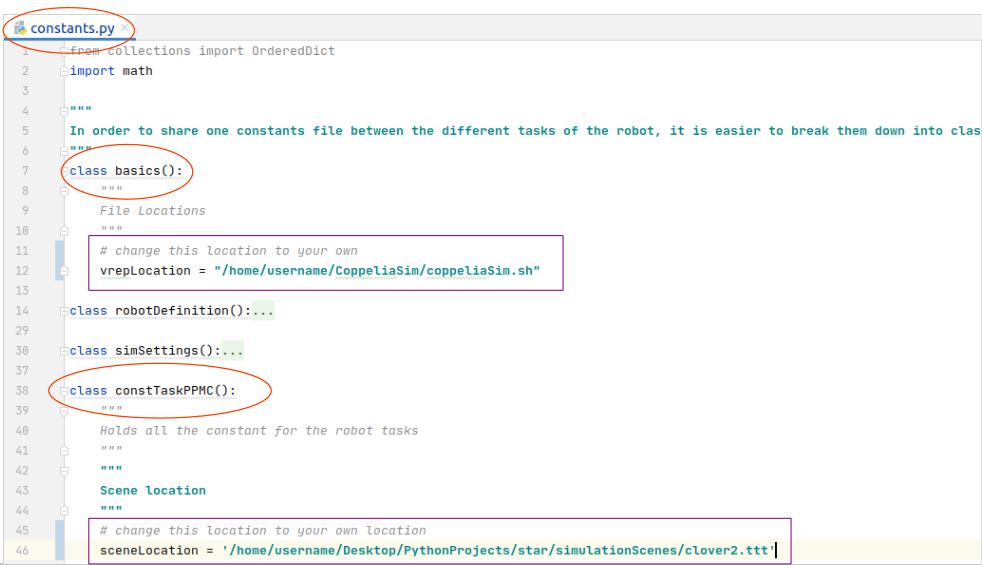
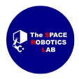

# RL STaR 

This README is intended to give guidance to users about how to get started using or contributing to this open platform.

## Welcome
Welcome to the Reinforcement Learning for Simulation based Training of Robots (RL STaR) Platform github page.

RL STaR was created for robotics researchers to advance research using reinforcement learning and machine learning, and to share this work with other researchers.

We created RL STaR in a modular way to be easy to use and easy to share RL applications for robotics. Training in simulation offers a safer and more time efficient environment, with the prospect of later transfer results to the real robot through simulation to reality transfer (sim2real).

We welcome all contributions, suggestions and feedback. Thank you for your interest.

## How To Configure RL STaR
You will need to clone this project from github, which will include the [OpenAI Baselines library](https://github.com/openai/baselines) and the RL STaR code. You will also seperately need to download [CoppeliaSim](https://www.coppeliarobotics.com/) from their website.

It is recommended to use a [virtual environment](https://docs.python.org/3/tutorial/venv.html) to contain all the python libraries.

After cloning this project, you can follow the Baseline instructions either from their site or down below to configure it:

    sudo apt-get update && sudo apt-get install cmake libopenmpi-dev python3-dev zlib1g-dev

Install Tensorflow (see below for more info about whether to install the GPU or non GPU version)

    pip install tensorflow==1.14

or

    pip install tensorflow-gpu==1.14

Inside the RLSTaR folder, run the following command to install the necessary packages for RL STaR:

    >>>.../rlstar$ pip3 install -e .

Inside the RLSTaR/baselines folder, run the following command to install the necessary packages for Baselines:

    >>>.../rlstar/baselines$ pip3 install -e .

### Installing Cuda (for Tensorflow-gpu):
Having a GPU allows for faster simulations. You must have an NVIDIA GPU compatible with the CUDA version you would like to run.

I followed the following instructions:
https://medium.com/analytics-vidhya/installing-tensorflow-with-cuda-cudnn-gpu-support-on-ubuntu-20-04-f6f67745750a

### Compatability
**Ubuntu:**
 * 18.04
 * 20.04

**CoppeliaSim:**
* 4_1_0_Ubuntu18_04
>Probably works regardless of version unless big changes will be made in the future

**Python:**

*   3.6
>3.5 should work too (Baseline states Python >=3.5 should work. Python 3.7 and above are not compatible with tensorflow 1.4, so be careful.)
> 
>You can download the right version via the Python website or any other means [Python](https://www.python.org/downloads/)

**Tensorflow:**
* 1.14-GPU
* 1.14
>While tensorflow 2.0 is out now, 1.14 is recommended if using the OpenAI Baselines library
>
>Running the learning algorithms with the GPU version will speed up the training process, however, the GPU must be properly setup first. See below for more information
>
>When installing tensorflow, you must specify if you want to install the gpu or non gpu version

**Cuda:**
* 10.0
* 11

**Gym:**
* 0.15.3 (recommended)
>(Tried on some prior versions, such as 13.~, If this is the case, some naming differences in the Baseline run file exist, i.e. changing the name _entry_point --> entry_point )

## How to Use RL STaR

There are three main components to the RL STaR platform: the RL library, the simulator and the Task Trainer. You should download CopelliaSim from their website which is the simulator this platform is compatible with. This platform ships with a frozen clone of Baselines, a reinforcement learning library holding a number of modern RL algorithms. This library should be swappable for a different library if you prefer to do so. The last componenet is the task trainer, which is what we created to interface between the prior two components and to train the robot for various tasks.

### Files of RL STaR
1. Constants
2. Functions
3. Main File
4. InOut
5. Simulator
6. Task

The **Constants file** is broken down into different classes that encapsulates different information. This file includes information about the robot, about the simulation conditions, about file locations and about the task, including reward function parameter values.

The **Functions file** includes different functions that can be used across different tasks.

The **Main file** groups everything together and serves as a central hub.

The **InOut file** acts as an itermediary between the task and the simulator file.

The **Simulator file** sends information to and from CoppeliaSim.

The **Task file** is where the user can define what he wants the robot to learn.

### Other Files
Aside from the files mentioned above several other files exist. Of particular importance are the CoppeliaSim "scene" files, which are what holds the environment and robot. These are placed within .../RLSTaR/simulationScenes/ and are denoted by ".ttt".

### CLOVER
The Space Robotics Lab is utilizing the CLOVER rover for lunar surface swarm and AI applications. The system is a small, lightweight robot that mainly utilizes off the shelf components, making it easy to build several of these rovers for research applications. CLOVER is a skid steer rear wheel drive vehicle. This means that there are only two motors (one for each side), and that it turns by creating a differential in wheel speeds between the left and right side.

### Adding New Robots and Tasks
RL STaR was designed to be modular. The OpenAI Gym framework makes it easy to share reinforcement learning problems with others, and this platform was intended to bridge the divide between machine learning and robotics applications.
We envision new applications being divided into two categories:
1. Robotic applications
2. Task applications

A **new robotic application** is when someone applies the RL STaR platform to a new robot. This could adding a bigger rover, for example.
A **new task application** is when someone applies the RL STaR platform to a new task. This could be training the robot to navigate a maze, for example.

* When creating a new robot application, one should create a new **main file** and a new **constants file**, making sure to register the name of the new environment (robot) in the *.../customfiles/enviornment/\__init\__.py* and the *.../customfiles/\__init\__.py* files.

* In order to add a new task, new parameters can added inside the exisiting robot's **constants file** as a new class. This new class should be imported into the main file as *const*. A new task file should also be added, calculating the reward function, observations, etc as you see fit. Make sure that the robot action space is set appropraitely, whether [0,1], [-1,1] or some other range (including discrete). The new task should also be imported into the main file "as taskX" (see file).

* The other files such as the **InOut file** and the **Simulator file** should be general enough to work across robot and task applications.

In order to reduce the overall number of files one has to create, we decided to group tasks by robot. While this reduces the number of overall files, it comes with the necessity to manually (for now at least) specify the task to be learned via the **Main file**.

#### Updating File Locations and Selecting the Task
Inside the **constants file**, the CoppeliaSim run file location and the CoppeliaSim scene are specified. Please change the path locations to where your respective files are located.

Within the **constants file** you can create a constants class to hold important variables. For convinence, name the new task constTaskName. This class can hold information such as reward function variables.

You can then specify the task for training via the **Main file**, here named Clover.py. Specify the task by importing the newly created task file and the constants class. Keep the naming convention "as taskX" and "as const".  

#### Linking to a new robot
Names of the robot components in CoppeliaSim and in the RL STaR constants.py file should be identical. Joints in CoppeliaSim are used as motors, and are set  to rotate a certain speed. The joints of the robot are defined in jointNames. The base of the robot is defined in baseName, and is used to get information about the robot, such as its position and the yaw angle from the simulator.

    wheelNames = ["left_front", "right_front", "left_rear", "right_rear"]
    numWheels = 4
    baseName = "base_link_respondable"
    jointNames = ["joint_left_front_wheel", "joint_right_front_wheel", "joint_left_rear_wheel",
                  "joint_right_rear_wheel"]

### Training
During the training process, you can run multiple sessions of CoppeliaSim and the training code at the same time. This is useful for tuning different parameters such as the neural network or the reward function.

Several useful commands:

The following command starts the training process for the "clover-1" environment for 1e5 timesteps. The RL algorithm chosen was PPO. The network is a custom network defined in *.../RLSTaR/baselines/baselines/common/models.py*. Several of the terms provide PPO2 paremers (gamma, nstep); more information can be found by going to the OpenAI Baselines website or by chekcing the code in *...RLSTaR/baselines/baselines/ppo2/ppo2.py*.

    OPENAI_LOGDIR=~/Desktop/Datafolder/trial01 OPENAI_LOG_FORMAT=tensorboard python3 -m baselines.run --num_timesteps=1e5 --network=mlp3 --nsteps=256 --alg=ppo2 --env=clover-v1 --gamma=0.90

The following command loads a previously trained agent and "plays" it. At this point it doesn't train anymore. The network should be identical to the one used during training.

    python3 -m baselines.run --alg=ppo2 --env=clover-v1 --num_timesteps=99999 --network=mlp3 --load_path=~/Desktop/Data/star/ppmc/test/noturn/trial01/checkpoints/XXXXX --play

This command launches a tensorboard session, allowing you to track the progress of an already trained/training session, with information about the average reward, length, etc.

    tensorboard --logdir firstTrial:~/Desktop/Datafolder/trial01,secondTrial:~/Desktop/Datafolder/trial02 --port=9999

The RL STaR paper [1] has more detailed information about training CLOVER using the Path Planning and Motion Control (PPMC) task.

## Authors   

The authors of this paper belong to the Space Robotics Lab, Department of Aerospace Engeering, Tohoku University:

>Tamir Blum, Gabin Paillet, Professor Mickael Laine, Professor Yoshida Kazuya

## Contributing

We would like to invite any users to share their own robots or tasks

## Citations

This platform can be cited via

>[1] RL STaR Platform: Reinforcement Learning for Simulation based Training of Robots [ARXIV Link](https://arxiv.org/abs/2009.09595) 

The path planning and motion control application can be cited via:

>[2] PPMC Training Algorithm: A Deep Learning BasedPath Planner and Motion Controller: [IEEE Link](https://ieeexplore.ieee.org/stamp/stamp.jsp?arnumber=9065237) or
[ARXIV Link](https://arxiv.org/abs/1909.06034)

>[3] PPMC RL Training Algorithm: Rough Terrain Intelligent Robots through Reinforcement Learning [ARXIV Link](https://arxiv.org/abs/2003.02655)

## Support
Please email TamirBlum1{at}gmail.com or open an issues ticket

## License
[GPL 3.0](https://www.gnu.org/licenses/gpl-3.0.en.html)